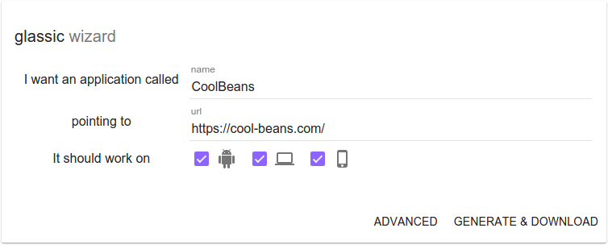

# glassic

Simple webview application generator for:

* android
* ios
* linux via nw.js
* mac via nw.js
* windows via nw.js

## Requirements

Developed with:

    $ node --version
    v0.12.7

## Installation

    npm install

This will install dependencies, compile according to [config.json](config.json)
and run the help command.

## Getting started

TODO: asciinema

Assuming you went through the installation step, you now the git repositories
for your applications. They can be found in the [templates](templates/) folder.

Lets run the desktop app:

    npm run demo:linux

or build the android apk:

    npm run demo:android

[Documentation and more info can be found here](wiki/Home.md).

To view the list of commands:

    npm run help

## License

Please see [LICENSE](https://github.com/mess110/glassic/blob/master/LICENSE) for licensing details.

## Author

Cristian Mircea Messel, [@mess110](https://twitter.com/mess110)
